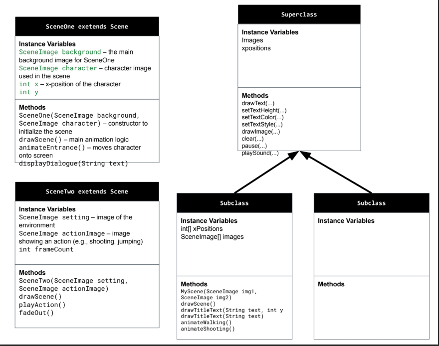
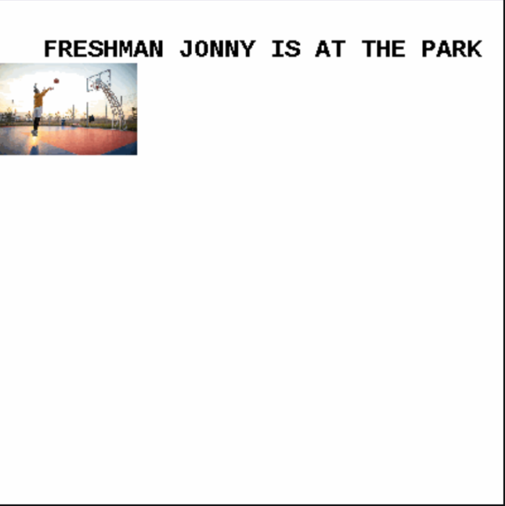

# Unit 7 - Creative Animation with The Theater Project

## Introduction

For this project, you will create an animation using The Theater that portrays a personal interest or solves a problem that you choose. Your program should demonstrate the object-oriented programming and software engineering skills and knowledge you have developed throughout the year.

## Requirements

Use your knowledge of object-oriented programming, data structures, and algorithms to create an animation using The Theater:

- **Use inheritance and polymorphism** – Create a superclass that represents shared attributes and behaviors with at least two subclasses that are more specific versions or variations of the superclass.
- **Method decomposition** – Use overloaded, overridden, and private methods to implement different versions of the same behavior, variations of a superclass behavior, and to improve code organization.
- **Use at least two data structures** - Use at least two 1D or 2D arrays or ArrayLists to store elements that are manipulated using loops and conditionals.
- **Implement one or more algorithms** – Implement one or more algorithms that use loops and two-way or multi-selection statements with compound Boolean expressions to analyze the data.
- **Create a visualization** – Create an animation that portrays a personal interest or solves a problem that you choose using objects, data structures, and methods.
- **Document your code** – Use comments to explain the purpose of the methods and code segments and note any preconditions and postconditions.

## Trello Board

Link the Trello board that you used to plan this project here. 

[My Trello planning board](https://trello.com/invite/b/67d45943d7fb814adf2ac024/ATTI5e29a3fdbb6b0d0af9f3db2918dce86bA44C3B32/unit-7-project-planning)

## UML Diagram

Put and image of your UML Diagram here. Upload the image of your UML Diagram to your repository, then use the Markdown syntax to insert your image here. Make sure your image file name is one word, otherwise it might not properly get display on this README.

![UML Diagram for my project]

## Video

Record a short video of your project to display here on your README. You can do this by:

- Screen record your project running on Code.org.
- Upload that recording to YouTube.
- Take a thumbnail for your image.
- Upload the thumbnail image to your repo.
- Use the following markdown code:

[![Thumbnail for my project] ][(youtube-URL-here)](https://www.youtube.com/shorts/VWqDff_aaIc) https://drive.google.com/file/d/1sdDG5QXwvs7lnTus2uAh9nBdfxQ7kYX-/view

## Project Description

Write a description the personal interest or problem that your animation addresses. Then explain the user story(s) you identified, and how they help frame making your animation.

My animation describes a personal interest which is basketball. The user story helped me frame my animation as I was able to make sketches and be able to put it out onto code and get it draw the images and animations I wanted to. 